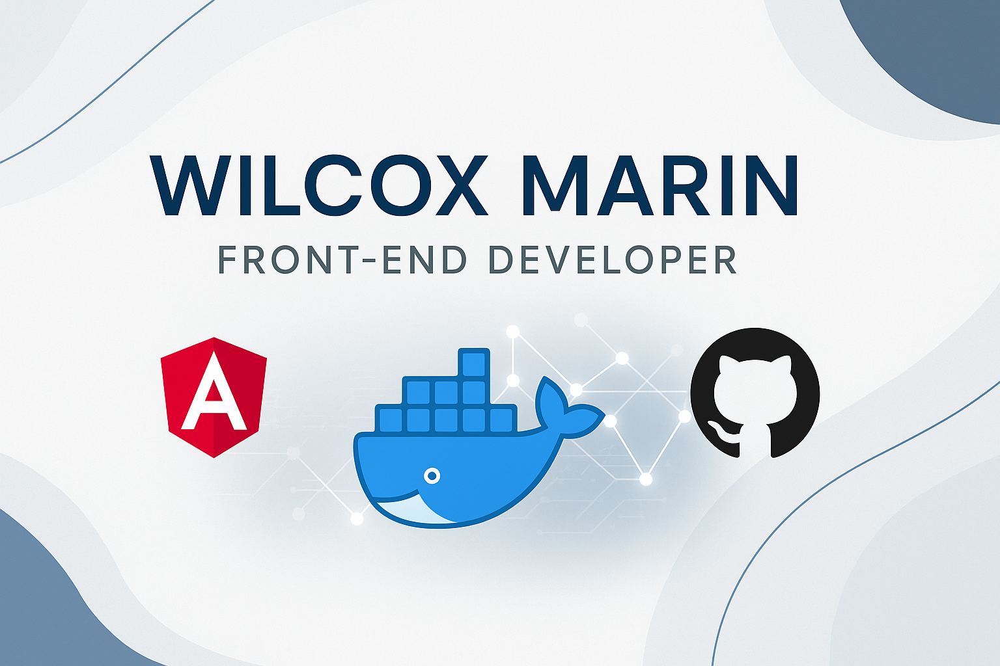

# 👋 Hi, I'm Wilcox Marin

🎯 **Front-End Developer | Tech Enthusiast | Lifelong Learner**  
🚀 Building scalable web apps, pixel-perfect UIs, and solving real-world problems with technology.

---

## 🧑‍💻 About Me
- 💼 4+ years of experience in **Frontend Development** with a strong focus on **Angular**.
- 🌍 Open to **remote opportunities** worldwide.
- 🛠 Proficient in **HTML**, **CSS**, **JavaScript**, and modern frontend frameworks.
- 💡 Experience with **Docker** and basic experience with **CI/CD pipelines**, deployments on **DigitalOcean**.
- 📱 Exposure to mobile development using **Flutter**.
- 🔄 Continuously learning **Node.js**, **NestJS**, and **Spring Boot**.

---

## 📈 Career Snapshot
- **Frontend:** 2+ years of experience in **Angular**, delivering dynamic and scalable web solutions.
- **Backend:** Basic experience in **Laravel**, **Node.js**, and **Spring Boot** for REST API development.
- **DevOps:** Worked with **Docker**, **Docker Compose**, **Nginx**, and **GitLab CI/CD**.
- **Databases:** Comfortable with **MySQL**, **PostgreSQL**, and **MongoDB**.

---

## 🛠 Tech Stack

**Languages**  

**Frontend**  

**Backend & DevOps**  

**Databases**  

---

## 📚 Currently Learning

---

## 📫 Connect With Me

---

⭐️ From [@wilcoxmarin](https://github.com/wilcoxmarin)
